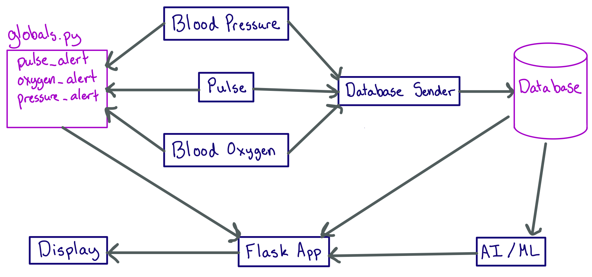

# health-monitor-team7

## Summary
This project simulates a Health Monitor setup for an ICU.

A user can see a patient's current blood pressure, blood oxygen levels, and pulse updated every 30 seconds. The past readings are also available for viewing.

An alert is sent if any reading returns a value outside of the given healthy interval. This alert is displayed on the monitor.

The readings are fed into an ML algorithm that returns predictions about future readings for the patient. This data is also displayed on the monitor.

This project was developed as independent modules that are described below.

## Modules
#### Blood Pressure
###### by Jessica Barry
The blood pressure module returns a blood pressure value in mm Hg when called. If the value generated is outside of the given healthy range, this module sets an alert flag on the global variable associated with this sensor. It also sets the current unhealthy value to the global variable for the alert. This ensures that an alert can be displayed on the monitor.

#### Blood Oxygen
###### by Laura Joy Erb
The blood oxygen module returns a blood oxygen percent when called. It uses a triangular distribution to simulate most readings being normal while some may fall outside of the given "healthy" range. If the value generated is outside of the given healthy range, this module sets an alert flag on the global variable associated with this sensor. It also sets the current unhealthy value to the global variable for the alert. This ensures that an alert can be displayed on the monitor.

#### Pulse
###### by Nadim El Helou
The pulse module returns a pulse value in beats per minute when called. If the value generated is outside of the given healthy range, this module sets an alert flag on the global variable associated with this sensor. It also sets the current unhealthy value to the global variable for the alert. This ensures that an alert can be displayed on the monitor.

#### Database Sender
###### by Rubeena Zaveri
The DB module calls the three sensor modules every 30 seconds. Once gathering the readings, this module sends that data to the database.

#### AI / Machine Learning
###### by Elizabeth Slade
This module reads the current and past values of the sensor readings from the database. Using this data, it predicts the readings for the patient in the future. These values are sent to the Flask App module.

#### Flask App
###### by Brian Macomber
This module is the coordinator for the project. It receives the AI predictions from the AI module, checks for alerts from the global alerts variables, and gets the most recent data from the database. It then sends that data to the html display file and renders it at the given route.

#### Display
###### by Gennifer Norman
The display module uses an html file to display the current and past values of all sensors. The values are displayed in a graph format. If any of the readings are outside of the healthy range, an alert will display for those sensors. The display is refreshed every 30 seconds as new data arrives.

## System Design
This is the diagram overview of how every module fits into the larger scheme of the project:

## Directions for set-up (Mac), for Windows:

https://packaging.python.org/guides/installing-using-pip-and-virtual-environments/

#### get a virtual environment

        python3 -m venv env

#### activate it

        source env/bin/activate

#### install requirements

        pip install -r requirements.txt

# run

        python3 flaskApp.py

#### If you pip install anything in your virtual environment, make sure to:

        pip freeze >> requirements.txt

    this will store your requirements so we won't have any module installation problems.

#### Navigate to localhost:5000 in a browser to view
